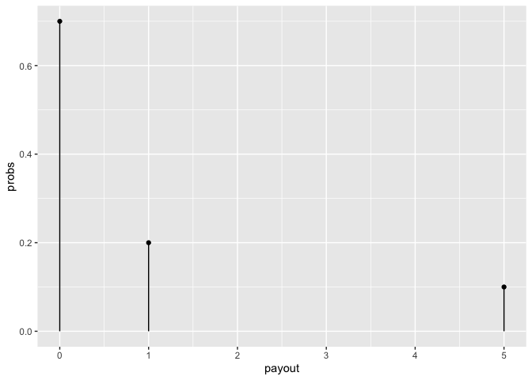

  - [Welcome to the ggtedious
    workshop\!](#welcome-to-the-ggtedious-workshop)
  - [Part 1. Work on functionality](#part-1-work-on-functionality)
      - [Step 0. Do it with base ggplot2 *can become problem statement
        later*](#step-0-do-it-with-base-ggplot2-can-become-problem-statement-later)
      - [Step 0.b Write like-to-have code *code chunk option eval =
        F*](#step-0b-write-like-to-have-code-code-chunk-option-eval--f)
      - [Step 1. Write compute group function and
        test](#step-1-write-compute-group-function-and-test)
      - [Step 2. Pass to ggproto object](#step-2-pass-to-ggproto-object)
      - [Step 3. Write geom\_post()
        functions](#step-3-write-geom_post-functions)
      - [Step 3.1 Bonus, write geom\_lollipop with list
        mechanism](#step-31-bonus-write-geom_lollipop-with-list-mechanism)
      - [Step 4. Test it out enjoy\! (possibly basis of examples and
        tests)](#step-4-test-it-out-enjoy-possibly-basis-of-examples-and-tests)
      - [Step 5. Formalize tests, write
        messages.](#step-5-formalize-tests-write-messages)
  - [Part 2. Build out package file structure,
    files](#part-2-build-out-package-file-structure-files)
      - [Step A. devtools::create and
        documentation](#step-a-devtoolscreate-and-documentation)
      - [Step B. Send code to .R folder and test\_that folder, we’ll use
        {readme2pkg}.](#step-b-send-code-to-r-folder-and-test_that-folder-well-use-readme2pkg)
      - [Step C. devtools::check](#step-c-devtoolscheck)
      - [Step D. Install and restart](#step-d-install-and-restart)
  - [Done\!](#done)
  - [Appendix. list of code chunks in this
    doc.](#appendix-list-of-code-chunks-in-this-doc)

<!-- README.md is generated from README.Rmd. Please edit that file -->

# Welcome to the ggtedious workshop\!

<!-- badges: start -->

<!-- badges: end -->

Let’s build a cool ggplot2 extension function. And then let’s put it in
a package. And let’s do it right\! It may require grit to endure the
tedium.

> ‘Testing your code can be painful and tedious, but it greatly
> increases the quality of your code. testthat tries to make testing as
> fun as possible, so that you get a visceral satisfaction from writing
> tests. Testing should be addictive, so you do it all the time.’ -
> testthat introduction (probably Hadley Wickham)

Building a simple, straightforward extension in good company
(workshop\!) will provide a misery-loves-company occasion to build a
correct package and build/strengthen testing muscles.

<https://angeladuckworth.com/grit-scale/>

Meeting objectives:

<!-- 0. My pre-step: Figure out what best practices for ggplot2 extension packages and testing are; and/or figure out some experts to ask for help. -->

1.  Practice a `compute_group` easy geom extension by creating
    geom\_post(); also bonus geom\_lollipop().
2.  Put them in a package using best practices
3.  Meet like-minded stats educators, ggplot2 extenders, and package
    developers.

Prerequisite:

Having written a ‘compute group’ geom extension. See:
<https://evamaerey.github.io/mytidytuesday/2022-01-03-easy-geom-recipes/easy_geom_recipes.html>
Seasoned R/ggplot2 users mostly spent \~ 15 minutes on each recipe.

# Part 1. Work on functionality

## Step 0. Do it with base ggplot2 *can become problem statement later*

``` r
prize_wheel <- data.frame(probs = c(.7, .2, .1), payout = c(0, 1, 5))

library(ggplot2)
ggplot(prize_wheel) + 
  aes(x = payout, y = probs) + 
  geom_point() + 
  aes(xend = payout, yend = 0) + 
  geom_segment()
```

<!-- -->

## Step 0.b Write like-to-have code *code chunk option eval = F*

``` r
# would show just line
ggplot(prize_wheel) + 
  aes(x = payout, y = probs) + 
  geom_post()

# line and dot
ggplot(prize_wheel) + 
  aes(x = payout, y = probs) + 
  geom_point() + 
  geom_lollipop()
```

## Step 1. Write compute group function and test

reference:
<https://evamaerey.github.io/mytidytuesday/2022-01-03-easy-geom-recipes/easy_geom_recipes.html>

## Step 2. Pass to ggproto object

## Step 3. Write geom\_post() functions

## Step 3.1 Bonus, write geom\_lollipop with list mechanism

``` r
geom_lollipop <- function(...){

  list(  
  geom_post(...),
  geom_point(...)
  )
  
}
```

## Step 4. Test it out enjoy\! (possibly basis of examples and tests)

## Step 5. Formalize tests, write messages.

``` r
testthat::test_that("multiplication works", {
  testthat::expect_equal(2*2, 4)
})
#> Test passed 🎉
```

# Part 2. Build out package file structure, files

## Step A. devtools::create and documentation

<https://evamaerey.github.io/package_in_20_minutes/package_in_20_minutes>

  - Step A.0: Already complete for workshop purposes: Create a readme
    file with usethis::use\_readme\_rmd()
  - Step A.1: Create package architecture using
    usethis::create\_package(“../ggtedious”)
  - Step A.2: Describe what the package does in the DESCRIPTION file
  - Step A.3: Create a license using usethis::use\_\*\_license()
  - Step A.6: Be explicit about dependency use in functions
  - Step A.6a. Declare dependencies using
    usethis::use\_package(“package\_name”); are added to DESCRIPTION
  - Step A.7: Document functions using ‘Roxygen’ skeleton

## Step B. Send code to .R folder and test\_that folder, we’ll use {readme2pkg}.

Functions send code to proper folders for packaging; but let them live
here first. Another valid alternative is copy and paste. Other package
building workflows will build the functionality straight away in .R
files.

``` r
library(readme2pkg)
chunk_to_r(c("geom_post", "geom_lollipop"))
chunk_to_tests_testthat("test1")
```

## Step C. devtools::check

  - Step C.1: Make the package “active” and test your functions
    interactively with devtools::load\_all()
  - Step C.2: Incorporate documentation additions into package using
    devtools::document()
  - Step C.3: Run a check on the new package using devtools::check()
  - Step C.4: Create some relevant tests with usethis::use\_test()
  - Step C.5: Build and install package using devtools::build()

## Step D. Install and restart

# Done\!

# Appendix. list of code chunks in this doc.

``` r
knitr::knit_code$get() |> names()
#>  [1] "unnamed-chunk-1"        "use_base_ggplot2"       "unnamed-chunk-2"       
#>  [4] "compute_group_post"     "try_compute_group_post" "ggproto"               
#>  [7] "geom_post"              "geom_lollipop"          "unnamed-chunk-3"       
#> [10] "test_multiplication"    "unnamed-chunk-4"        "unnamed-chunk-5"
```
